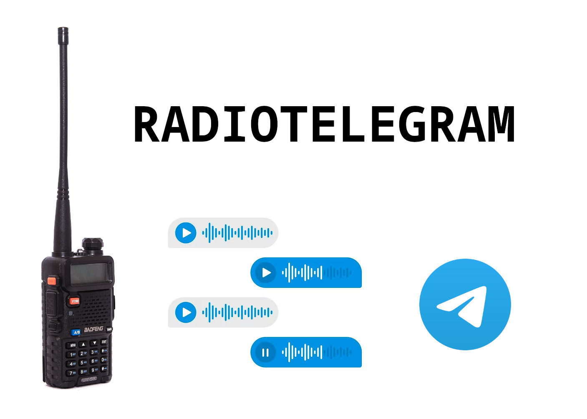
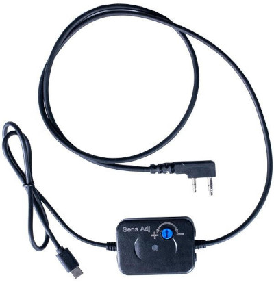
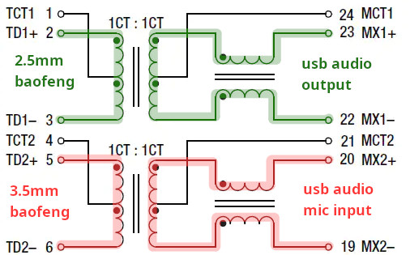

# radiotelegram

Telegram voice messages <> Baofeng radio RX/TX two-way bridge (half-duplex) with advanced audio processing.


## description
`radiotelegram` is a software-hardware project allowing you to to communicate with peers in Telegram chat using your handheld radio (walkie-talkie).
 - RX is recorded and sent to Telegram chat (topic) as a voice message.
 - incoming chat voice messages are played into radio TX with enhanced audio processing.

## enhanced audio processing features
- **Advanced Squelch**: Multi-criteria signal detection with spectral analysis and adaptive noise floor
- **Voice Detection**: Frequency domain analysis optimized for voice communications (300Hz-3.4kHz)  
- **Radio-optimized Processing**: Pre-emphasis, bandpass filtering, and dynamic range compression
- **Noise Reduction**: Spectral noise reduction with adaptive thresholds
- **PTT Reliability**: Wake tone generation for consistent radio keying
- **Quality Enhancement**: Loudness normalization and overmodulation prevention 


## hardware
Hardware requirements:
- UR-5V Baofeng handheld radio (or compatible)
- PC audio adapter 
    - buy [APRS K1 PRO](https://baofengtech.com/product/aprs-k1-pro/) 
    - DIY adapter (see schematics below)




### adapter DIY guide
Components:
- (usb) audio card
- 2.5mm jack cable
- 3.5mm jack cable
- ethernet transformer — you can find one in unused electroncs: old routers, pc motherboards or other devices with ethernet ports.




| Jack             | Contact Points |
|------------------|----------------|
| 3.5mm Baofeng    | Sleeve, Ring   |
| 2.5mm Baofeng    | Sleeve, Tip    |
| 3.5mm Microphone | Sleeve, Tip    |
| 3.5mm Headphones | Sleeve, Tip    |

1. find a datasheet for your ethernet transformer
2. select two pairs as shown on the schematics
3. cut cables, solder wires, that's it
4. polarity is not that crucial, for voice it's ok both ways.


## software

### config
1. copy `.env.example` to `.env`
2. edit file: fill bot token, group id and topic id (if present).

### dependencies
```
sudo apt install ffmpeg python3-venv portaudio19-dev python3-dev build-essential 
```

> Note:
> `pyaudioop` was disconutinued in python3.13 so audioop-lts package is used.

    python3 -m venv ./venv
    source ./venv/bin/activate
    pip3 install -r requirements.txt

    python3 ./radiotelegram/main.py

## tuning (required)

1. put baofeng into VOX mode (1/10).
2. adjust main volume knob so that audio doesn't clip (<100% volume).
3. adjust pc audio output volume so there is no voice distortion on the receiving end.

> less is more. do NOT use full volume.

# license
MIT

# credits
thx to claude sonnet 4 for comprehensive audio analysis and filter code generation.
